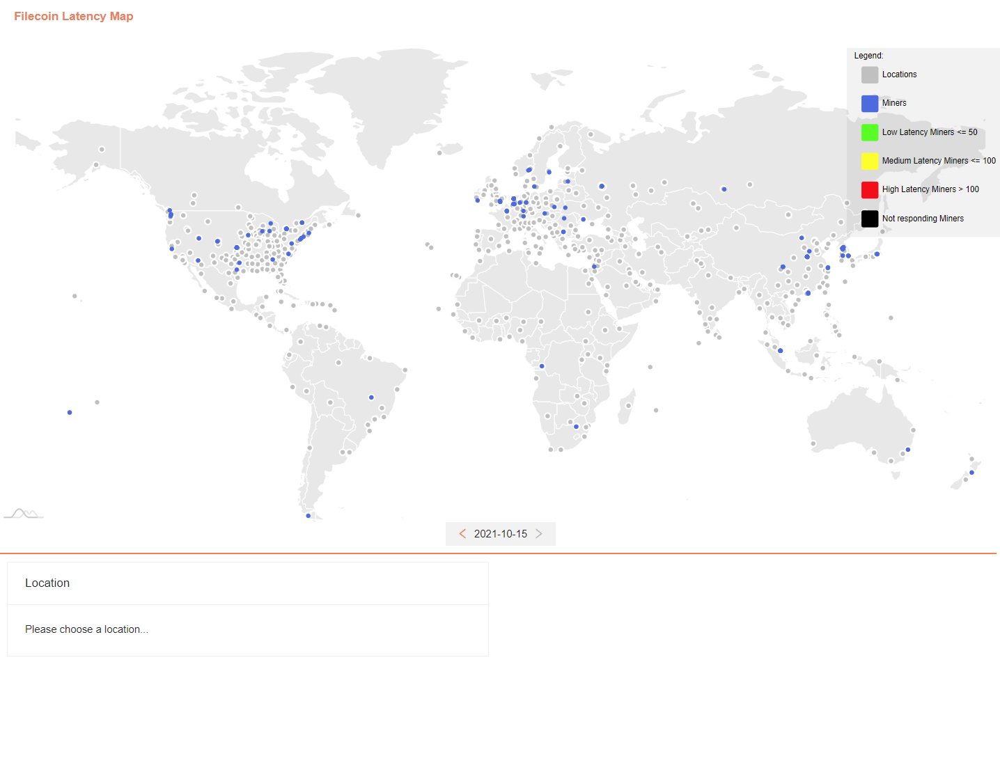
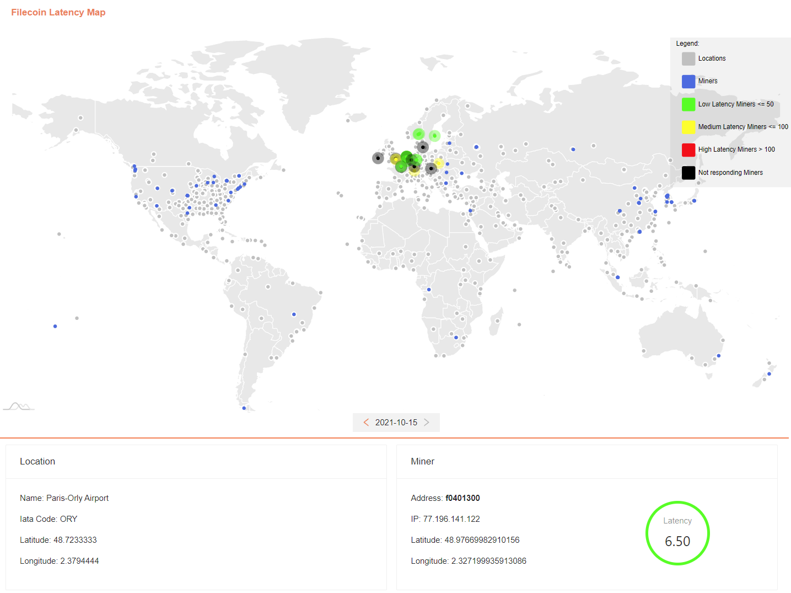

# FC Latency Map

[](https://github.com/ConsenSys/fc-latency-map/actions/workflows/workflow.yml)
[](https://goreportcard.com/report/github.com/ConsenSys/fc-latency-map)

[](/LICENSE-MIT)
[](/LICENSE-APACHE)

## Description

FC Latency Map is a service for [Filecoin](https://filecoin.io/) decentralized storage network to obtain latencies of all active miners.

It uses [Ripe Atlas](https://atlas.ripe.net/) to collect measurements of active miners from relevant locations in the world.

## Requirement

- [Docker](https://docs.docker.com/get-docker/) is installed.

- 10Gb of free disk space.

## Quickstart

### Get the project

Clone the project locally:

```shell
git clone https://github.com/ConsenSys/fc-latency-map.git
```

### Build the project

Build all the Docker images required to start the project:

```shell
make
```

### Change default config

During build phase, `.env` config files were generated in `./manager/` and `./map/`. To start the services, change the 2 default values on the manager config file.

Edit `./manager/.env` and change:

```
[...]
FILECOIN_NODE_URL=changeme
[...]
RIPE_API_KEY=changeme
```

### Start the project

Finally, start the services:

```shell
make run
```

The Fc Latency Map should be available at: [https://localhost:3000](https://localhost:3000)

### Examples

Example of Filecoin Latency Map:



Example of Filecoin Latency Map with Location and Miner selected:


