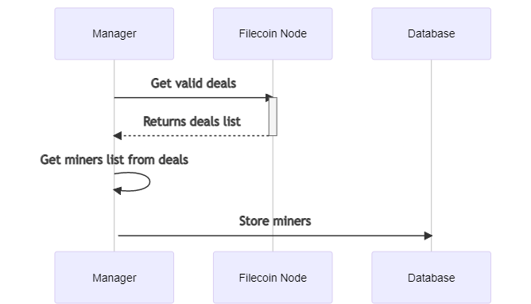
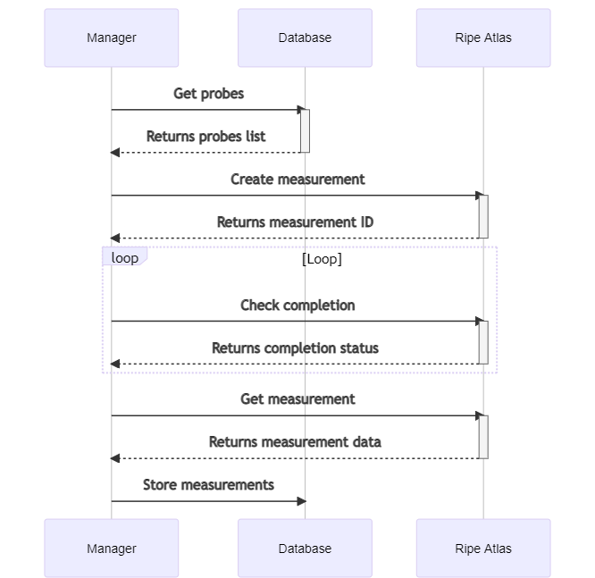
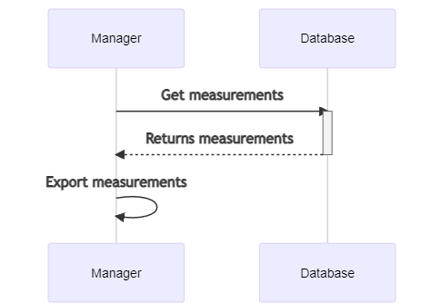

# FC Latency Map

## Description

FC Latency Map are services for [Filecoin](https://filecoin.io/) blockchain to get latencies of active miners.

It uses [Ripe Atlas](https://atlas.ripe.net/) to collect measurements of every active miners from relevant location on the world.

Get the project:

```shell
git clone https://github.com/ConsenSys/fc-latency-map.git
```

## Manager

### Quickstart

Start the Manager cli:

```shell
cd manager
cp .env.example .env
```

| Key | Value type | Description |
| --- | --- | --- |
| RIPE_API_KEY| string | [Ripe Atlas key management](https://atlas.ripe.net/keys/)       |
| RIPE_PING_INTERVAL| number  | Interval between ping to get miners latency |
| RIPE_PING_RUNNING_TIME| number | Running period get latency|
| RIPE_ONE_OFF | boolean | On ping only to get latency. When is 'true' the RIPE_PING_INTERVAL and RIPE_PING_RUNNING_TIME are ignored|
| RIPE_REQUESTED_PROBES | number | Max number of probes to call miners |
| RIPE_LOCATION_RANGE_INIT | float | Initial range to find probes from airport location |
| RIPE_LOCATION_RANGE_MAX | float | Max range to find probes from airport location |
| IPGEOLOCATION_ABSTRACTAPI_KEY | string | [IPGeolocation api key management](https://app.abstractapi.com/api/ip-geolocation/tester) to obtain miner geolocation |


Edit .env to add a valid Ripe Atlas API Key

After update the .env file execute:

```shell
go run cmd/cli/cli.go
```

### Diagrams

Get miners



Get probes


Create measurements



Export reasults



### Documentation

[./manager/README.md](./manager/README.md)

[JSON Schema for data](./docs/json/schema.json)