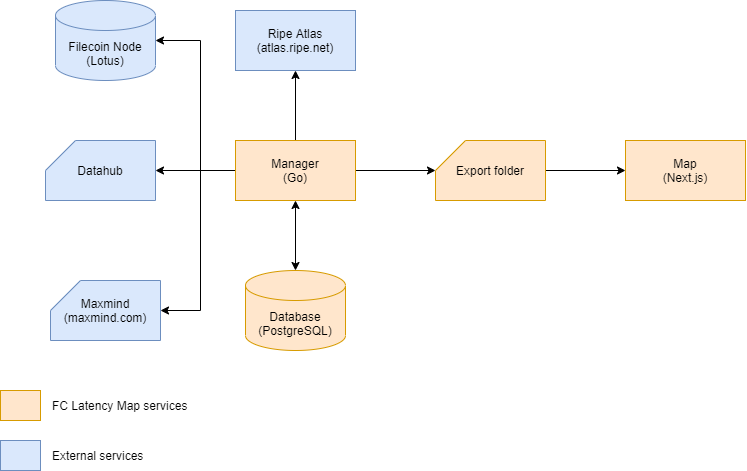
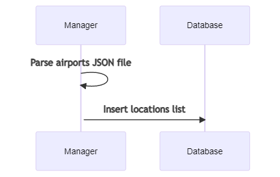
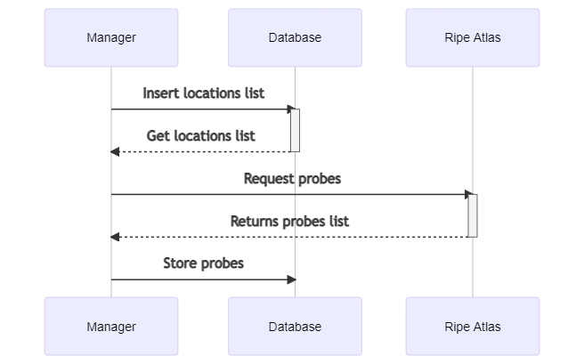
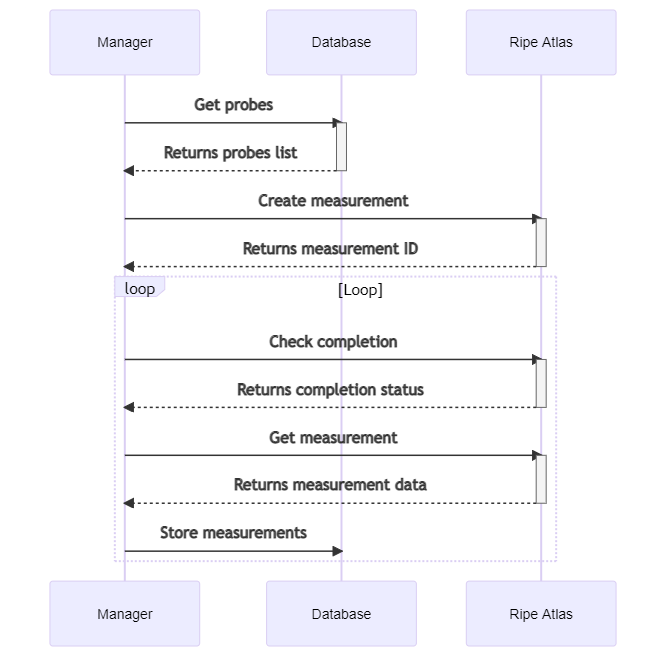

# FC Latency Map Technical Design

## Description

The FC Latency Map is composed of 2 main services:

- The <strong>Manager</strong> is responsible for getting all active miners and creating a latency metric for each. Manager data is stored in a local PostgreSQL database and each time measurements are made a JSON file is exported.

- The <strong>Map</strong> is a tool for easily exploring exported JSON files. It imports the JSON files and displays a latency map.

## Architecture

### System diagram

<strong>Ripe Atlas:</strong> open, distributed Internet measurement platform that measure Internet connectivity in real time.

<strong>Filecoin Node:</strong> node connected to Filecoin blockchain.

<strong>Datahub:</strong> JSON file with airports list.

<strong>Maxmind:</strong> JSON file with IP geolocations.

<strong>Manager:</strong> Go service to create and export measures in JSON.

<strong>Export folder:</strong> JSON measurement results folder.

<strong>Map:</strong> React application to display measurements.

### Database diagram

Database [dbdiagram model file](./filecoin_latency_map_dbdiagram)

## Sequence diagrams

[Mermaid models file](./diagrams_mermaid.mmd)

### Get miners

#### Description

Active miners are retrieved from Filecoin Lotus node.

First, the current active deals are retrieved.

Then the active offers are analyzed in order to obtain information about the minors which is stored in the database.

#### Diagram

### Get locations

#### Description

Large airports are used to obtain relevant locations around the world.

They are imported from [https://datahub.io/core/airport-codes#data](https://datahub.io/core/airport-codes#data) and stored in the database.

#### Diagram

### Get probes

#### Description

For each airport, a list of relevant probes is collected around them.

They are searched at close range and until the limit is reached the search is done continuously with increasing distance.

The coordinates of Ripe Atlas probes can be reversed (the latitude is longitube and vice versa), so that each probe location is double-checked with the [Maxmind.com](https://maxmind.com) service.

#### Diagram

### Create measures

#### Description

To get measurements:

- The probes are first selected from the database.
- Then, a traceroute measurement is sent to Ripe Atlas.

#### Diagram

### Get measures

#### Description

To get measurements:

- Loop control for updating and completing the measurement.

#### Diagram

### Export measures

#### Description

Everytime measures are retrieved results are exported in a JSON file. See <strong>JSON schema</strong> bellow for more details.

#### Diagram

## JSON export schema

Each export is represented by a JSON file with all active miners info, selected probes info, airports location info, and the measurements of the day.

The JSON file schema is: [./json/schema.json](./json/schema.json)

The JSON file naming convention is: `export-YYYY-MM-DD.json`

## Ripe Atlas costs

Costs formula:

`miners x locations x (probres anchor + probes) x traceroute price`

Miner average settings for measurement:

| Entity           | Quantity |
| ---------------- | -------- |
| miners           | 1        |
| locations        | 75       |
| probes           | 5        |
| traceroute price | 10       |

Estimations:

<strong>For 1 miner</strong>

1 x 75 x 5 x 10 = 3750 Ripe tokens / each measure

<strong>For all 165 active miners</strong>

Currently on october 2021 there are 165 active miners, so:

3750 x 165 = 618 750 Ripe tokens for the one measure on 165 miners.
